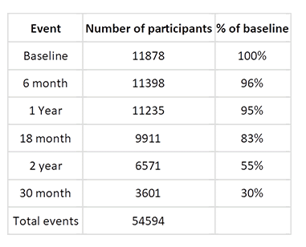

## Directory Navigation Info 

Current directory (i.e., `/data/NIMH_scratch/abcd-downloads-KarenB-group` on biowulf) contains the ABCD Release 3.0 structural imaging data, genomic data and pubertal measures as requested 
by Karen F. Berman's group. In case users would like to access additional pubertal and developmental measures other 
than the ones available on  `./downloads/pubertal`, they can do so by looking up on `./nda_packages/ABCDStudyNDA` which 
contains the pre-packaged data distributed by ABCD group through NDA.  

```bash
.
├── CHANGES_DSST
├── code
│   ├── notebooks
│   └── scripts
├── downloads
│   ├── genome
│   ├── pubertal
│   └── structurals_release3.0
├── nda_packages
│   ├── ABCDStudyNDA
│   ├── genome_packages
│   └── imaging_packages
├── __pycache__
│   └── nda_aws_token_generator.cpython-39.pyc
└── README.md
```
- `downloads` contains genome, pubertal and structural imaging data in their respective directories
    - everything within `downloads` directory should be considered raw data (raw data includes minimally processed 
      structural imaging data as well) 
    - genomic data was downloaded as zip files; these have been extracted. However, zipped files have been preserved for 
      any future use cases. 
    - structural imaging data live in sub-directories starting with `submission` in their name. Within these 
      sub-directories are `.tgz` scans.
    - pubertal measures are tab separated text files. These data structures found by searching for the term (using cmd+F)
      `puberty` and `pubertal` in their filenames or descriptions.
        
- `nda_packages` data structures (with s3 file locations) that were preprocessed to download data available in `downloads` 
  sub-directory.
    - The third annual curated ABCD Data Release 3.0 (by ABCD Study Group) can be found here `./ABCDStudyNDA`. 
    Following is a brief description of the curated data release as found on 
    
    
    

  >The third annual curated ABCD Data Release 3.0 is available now on the NIMH Data Archive. 
  > In addition to baseline data on the full participant cohort (nearly 12,000 participants), 
  > Data Release 3.0 contains early longitudinal data, including approximately half of the 2-year 
  > follow-up neuroimaging data (second imaging timepoint), as well as follow-up phenotypic data 
  > for the 6-month and 1-year visits on the full cohort. Interim data are also available for the 
  > 18-month, 2-year, and 30-month visits (see Table below). Smokescreen genotyping array data 
  > with TOPMed imputations are available as well. These include common variations, 
  > as well as variations associated with addiction, smoking behavior and nicotine metabolism. 
  > Authorized users can obtain more information and access the updated data from https://nda.nih.gov/abcd. 
  > Full details are in the Release Notes for Data Release 3.0.
  > 
  
- `code` contains the python notebook and scripts used to generate aws tokens. These were used to preprocess 
  data structures before downloading data.
  

      
    


